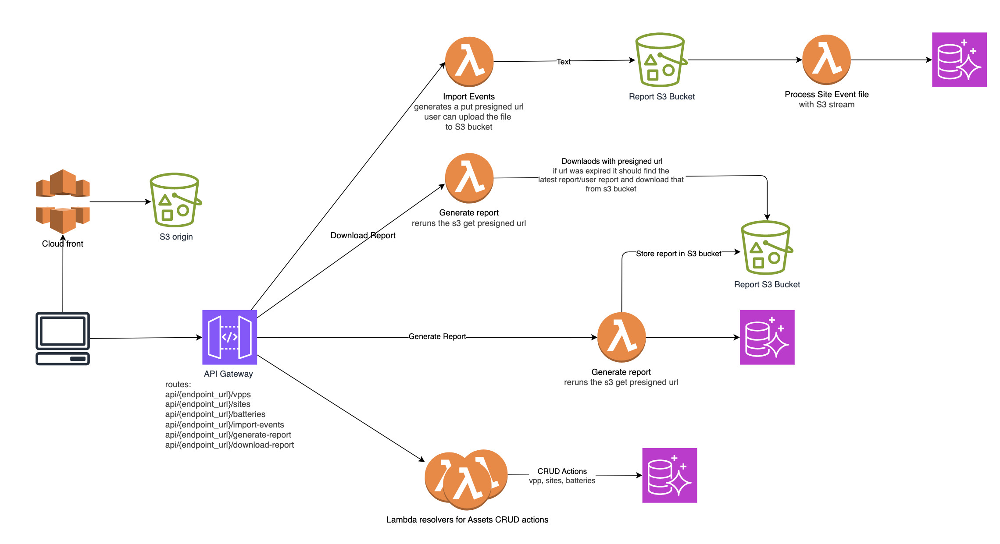

### Assignment
Original instructions were stored in requirements directory [Part1](requirements/part1.md) and [Part2](requirements/part2.md).

### Part 1: Simple program using Python that can calculate the distribution of revenues for (fictional) VPPs based off (fictional) charge & discharge data.


How to run the report generator service:

- Setup
    - Root Directory: cd ./implementation
    - Create env environment: python3 -m venv env
    - Activate the virtual env: source env/bin/activate
    - Install requirements: pip install -r requirements.txt
- Project Structure:
```
        implementation/
        ├─ service/
        │  ├─ report_generator.py       # Main CLI service
        │─ utils/
        │  └─ vpp_utils.py           # Core VPP logic and helper methods
        ├─ tests/
        │  └─ unit_test_utils.py        # Pytest unit tests
        ├─ events_file.csv               # Sample events file
        └─ requirements.txt
```
p.s. There is a [chain_of_thoughts](implementation/chain_of_thoughts.md) file, that is just my load thinking and repeat of summery for requirements

- Run handler: 
    - python -m service.report_generator
    - use the sample from **STDIN.txt** file.
    - generated report would be like and will be saved to **vpp_report.json** file:
        ```
            {
                "vpp": "Test VPP One",
                "month": "2025-09",
                "totals": {
                    "total_revenue": 1.75,
                    "vpp_ad_valorem_fee": 0.35,
                    "vpp_cost_only": 0.0,
                    "vpp_total_revenue": 1.75,
                    "site_total_revenue_after_fees": 0.0
                },
                "sites": {
                    "9876543210": {
                    "nmi": "9876543210",
                    "address": "426 King St Newcastle West NSW 2302",
                    "site_capacity_kwh": 13.5,
                    "site_revenue_before_fees": 1.4,
                    "site_daily_fee": 1.4,
                    "site_revenue_after_fees": 0.0
                    }
                }
                }

        ```

- Run test cases
    - pytests -v -s


### Part 2:

To design the UI -> API -> AWS Resources for this report service, I assume we are fully on AWS, we don't have requirements like being multi cloud or the neccessity of being able to run the Service APIs and UI locally.

Two ways to implement this (more specifically the API service): 
- option 1: FastAPI, ELB, Docker, Fargate > ECS Tasks runs the docker image, Postgres SQL, Postgres schema with SQLAlchemy, and React UI
- option 2: API Gateway, Lambda , Postgres SQL, Appsync Graphql for type safety, Postgres SQL:


My preference for this API service is Option 2, simple enough to choose the standard services and I am not using DynamoDB here only because the data structure is very clear, easy to define from the begining and due to the relation between model classes, I rather to go with relational database. instead of Dynamo db and a single table. 


#### Solution architecture

for further information please refer to [architecture/part2-service_design.drawio](architecture/part2-service_design.drawio)



#### API Endpoint:
```
Create VPP: POST /vpps { name, revenue_percentage, daily_fee_aud? }

Update VPP: PUT /vpps/{vpp_id} 

Create Site: POST /sites  { vpp_id, nmi, address }

Update Site: PUT /sites/{site_id} 

Reassign a Site to another VPP: POST /sites/{site_id}/assign-vpp/{vpp_id}

Add battery to site: POST /sites/{site_id}/batteries { manufacturer, serial, capacity_kwh }

Update battery: PUT /batteries/{battery_id}

Remove battery: DELETE /batteries/{battery_id} 

Stream import: POST /import-events (multipart CSV); returns { imported, skipped }

Revenue-sharing: POST /generate-report/{vpp_id}?month=YYYY-MM; return s3 presigned url to download the report when it's ready

Download report: GET /download-report

```

#### Streaming the Events file in rather than pulling it all into memory
for file uploads I usually go with 
- an apigateway lambda resolver that generates a put presign url so that user can uploading the csv file to S3 bucket.
- S3 upload/ file create event can trigger the lambda function to process the event csv file
- Lambda can process the file with S3 read Stream, if file is too big, at each point we can update the status of ingest/import within database for the given file, so that if it was intrrupted we can retry from the failing checkpoint.

#### Comments towards observability:
lambda function will log into cloudwatch log group, we can have metrics and alarms if i.e. a lambda error rate is more than 5%

#### Comments towards REST endpoint “productisation”, e.g. auth, rate limiting
API gateway supports rate limiting to avoid malicious invokations.
API Gatewat supports multiple way for authentications, one simple but not safe is API Key, another approach is Lambda authoriser, or Cognito user pool, and I think IAM is also another authorization method. 

Also Lambda Execution role needs to have least privilage access with restricted IAM policies to only allow permissions to integrated services and nothing more. 

For Input Validation we could Validate query params, headers, request body. Prevent invalid or malicious data.


